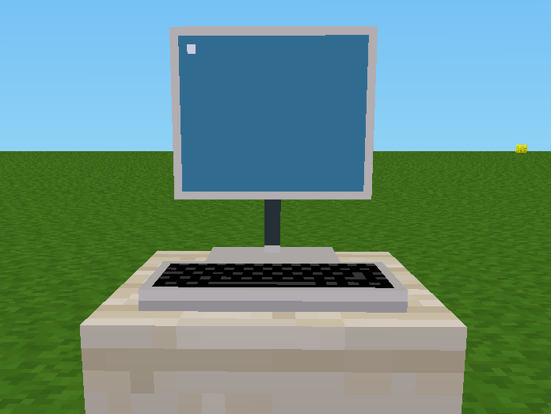
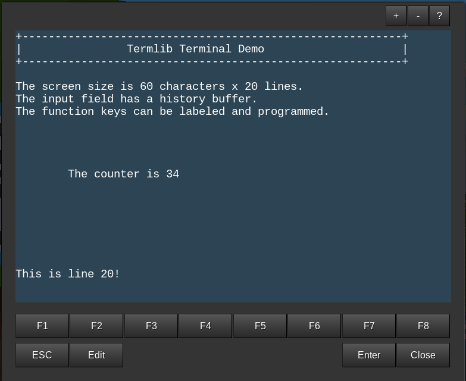

# Terminal Library [termlib]

**A Library for Minetest text terminals**

This mod comes with a example terminal to be used with TechAge or
Beduino Controllers.






### Features

- Screen memory handling, configurable size
- Programmable function keys (F1 - F8)
- Command history buffer
- Escape sequences for clear screen, goto line, ...

### Techage Lua Controller Example

This is the code for the screenshot 2.

- `$put_str(s)` is used to output text
- `$get_str()` is used to read/input text

**Init Code:**

```lua
cnt = 0

$put_str("\b")  -- clear screen
$put_str("+----------------------------------------------------------+\n")
$put_str("|                Termlib Terminal Demo                     |\n")
$put_str("+----------------------------------------------------------+\n")

$put_str("\nThe screen size is 60 characters x 20 lines.\n")
$put_str("The input field has a history buffer.\n")
$put_str("The function keys can be labeled and programmed.\n")

$put_str("\27\2\20This is line 20!")
```

**Loop Code:**

```lua
$put_str("\27\2\12")
$put_str("\tThe counter is " .. cnt .. "\n")
cnt = cnt + 1

s = $get_str()
if s then
    if string.len(s) == 1 and string.byte(s, 1) > 127 then
        $print("Function key code: " .. string.byte(s, 1))
    else
        $print(s)
    end
end
```


### License

Copyright (C) 2022-2023 Joachim Stolberg

Code: Licensed under the GNU GPL version 3 or later. See LICENSE.txt

Textures: CC BY-SA 3.0


### Dependencies

Required: none
Optional: techage, beduino


### History

- 2022-12-26  V1.00  * First version
